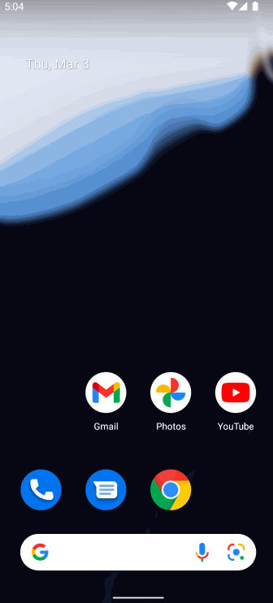

# FetchRewardsExercise
Coding Exercise for Android Internship Position 

## Solution Final
I employed the MVVM architecture in my project, albeit it being my first experience with this design pattern, hence not perfect. Currently, it doesn't have data persistence, but I plan to incorporate it via SharedPreferences or Room Db. For parsing JSON data, I used Gson in conjunction with Retrofit for handling network calls. Additionally, I sorted the data objects while mapping them from the network layer to the domain layer. To enhance the user experience, I implemented a basic caching system, and the data is presented to the user via Recycler View
- 
### App Walkthough GIF

 
